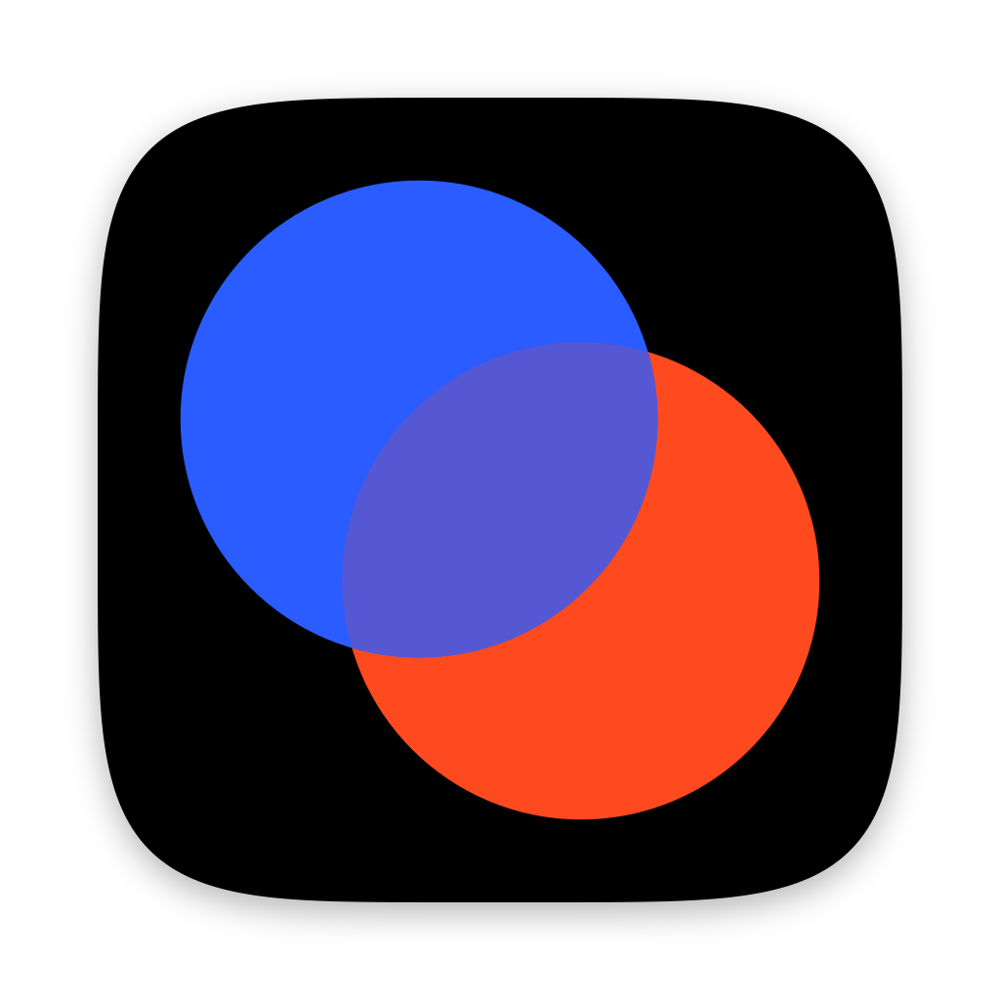
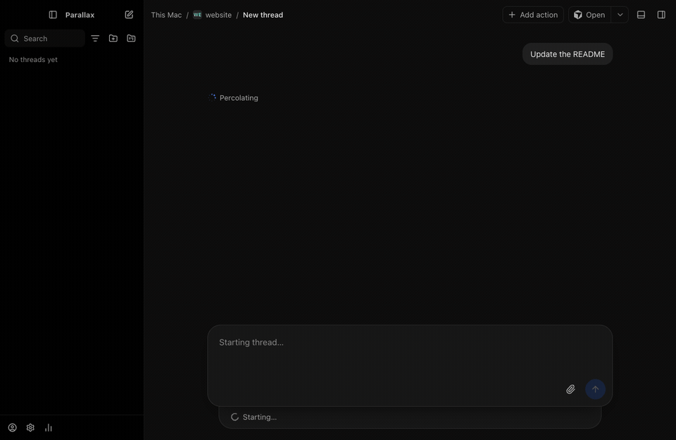
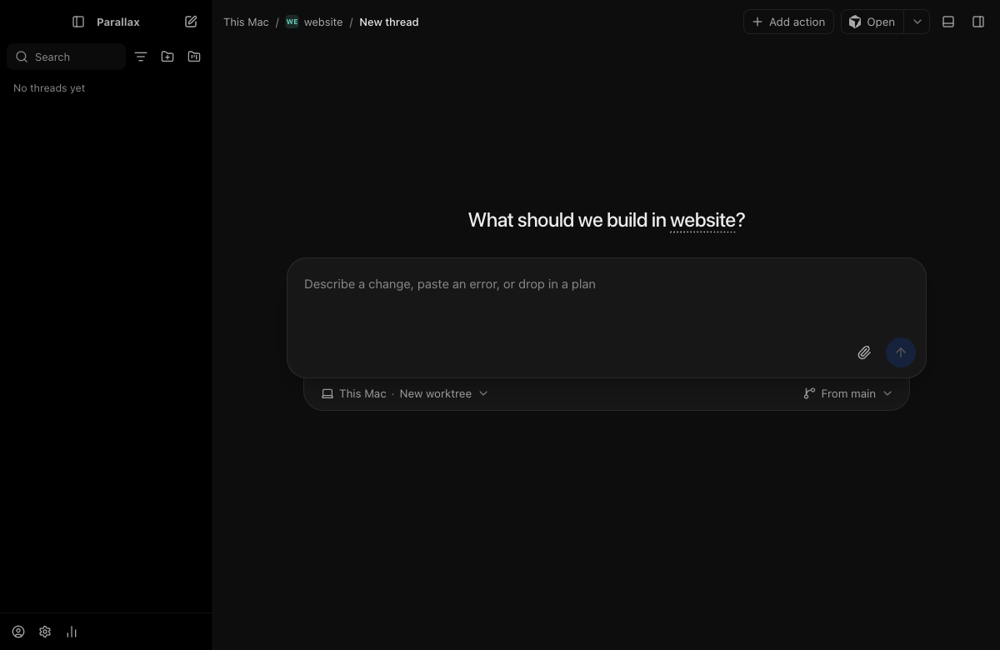
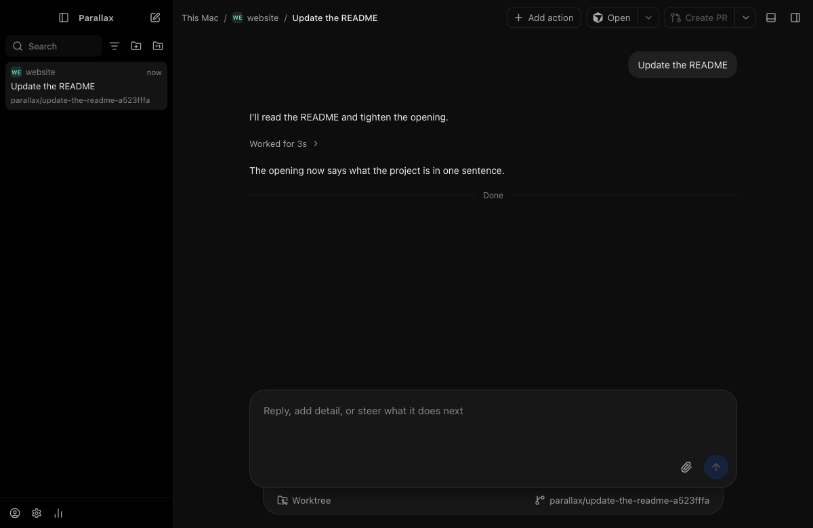

  
 <h1 align="center">Parallax</h1> 
Agent projects, on computers you own.
 <!-- TODO: Project demo GIF. Show a coordinator splitting work across two or more children, the children running, and the work landing. --> 
  

Parallax is an open-source desktop app that runs coding agents on computers you own. It brings the project workflow that hosted tools are now adopting to a machine you control: one coordinator plans, and a team of agents does the work.

A project is one coordinator chat. The coordinator plans the work and hands each piece to a subagent. It does not write code itself. Each subagent works in its own git worktree, and all of them share a folder of project context: a brief, research, test instructions, and your preferences. Finished work lands on the project's integration branch after you approve it.

The work runs in plxd, a Rust daemon on the host. The host is this computer, or another one you reach over SSH, such as a Mac mini or a Linux server. A project on a remote host keeps running with the laptop closed. The desktop app attaches to plxd and shows the chats, the subagents, and their changes.

Parallax runs the coding agents you already use: Claude Code, Codex, and Cursor, with API keys as a fallback. It can also run OpenCode, Pi, and other agents that speak the Agent Client Protocol in plain threads.

<!-- TODO(Ryan): Check the provider list above against Settings > Providers in the current nightly. Sources: release notes for PLX-366, PLX-532, PLX-558, and PLX-559, and decisions 0040, 0042, and 0053. -->
A thread is a single-agent chat, in a repository or not, with no coordinator.

  
 
  

The sidebar lists projects and threads. The main pane is the chat. A thread starts from the composer: pick a repository, say what you want, and the agent works in a worktree on the host.

Download
Builds are on the Releases page. For now every Parallax build is a nightly prerelease. There is no stable release yet. Take the newest release whose tag ends in -nightly.

<!-- TODO(Ryan): The release GitHub marks "Latest" is v2610.10118.11324 (Oct 1). It is an older build whose files are still named "wisp", and v0.2.0 is also a Wisp release. A visitor who clicks "Latest" gets a pre-rename build. Consider marking a current build as Latest, or editing those releases, before pointing people here. -->
OS	File	Notes
macOS	parallax-<version>-nightly-mac-arm64.dmg	Apple Silicon only. There is no Intel build.
Windows	parallax-<version>-nightly-win-x64.exe, -win-arm64.exe	Claude Code subagents run in WSL2, because native Windows can't sandbox them.
Linux	parallax-<version>-nightly-linux-x86_64.AppImage, -linux-arm64.AppImage	Run chmod +x on the file, then run it.
Host only	parallax-plxd-<version>-nightly-linux-x64, -linux-arm64, -mac-arm64	The plxd daemon by itself, for a host with no desktop. The app can also install and update plxd on an SSH host from Settings.
Each release has a SHA256SUMS file.

<!-- TODO(Ryan): Are the macOS and Windows builds signed and notarized? If not, add the Gatekeeper and SmartScreen steps here. Packaging and signing is still open in PLAN.md (PLX-64). --> <!-- TODO(Ryan): Confirm the Windows note. It comes from PLAN.md's risk list and decision 0023. Decision 0042 says Project children no longer use the worker sandbox, so it's unclear whether this still applies to Project children on Windows. --> <!-- TODO(Ryan): Confirm whether a standalone plxd binary is published for Windows. The newest nightly has none. -->
You also need, on the host:

Each agent's CLI, installed and signed in, for the agents you want to run. Settings > Providers can install some of them.
Node.js 22.13 or newer for Cursor, which runs through Cursor's SDK.
git. Parallax can install gh and start the GitHub sign-in for pull requests.
<!-- TODO(Ryan): After PR #685 merges, Claude needs Node.js 22.16 or newer on the host (decision 0061). Add that line when it ships. Today Claude runs as `claude -p` with no Node requirement of its own. -->
Why Parallax
Plenty of good tools run coding agents in parallel worktrees. Parallax is built around one workflow: a coordinator that keeps a project's context and hands work out, on a host you own.

Cursor Projects runs a project on a cloud computer it hosts, on paid Cursor plans. Parallax runs it on your own machine, with the agents and subscriptions you already have, and it is open source.
Orca (MIT) runs many CLI agents side by side, each in its own worktree. It can put them on SSH hosts or on an Orca server you run. It also has a coordinator and worker mode through its CLI. In Parallax, the coordinator chat is the main way you work.
T3 Code (MIT) is a desktop app for coding agents with remote environments over SSH, LAN, and its own relay. Parallax's layout and thread orchestration follow T3 Code. Parallax adds projects, with a coordinator, shared context, and an integration branch.
Superset runs many CLI agents in worktrees, with remote hosts through Superset Relay on its paid plan. Its desktop app is for macOS, with an experimental Linux build. Parallax runs on macOS, Windows, and Linux, and needs no account to reach an SSH host.
Conductor is a free Mac app that runs Claude Code, Codex, and Cursor agents in parallel workspaces. It is not open source. Parallax is Apache-2.0 and runs on Windows and Linux as well.
<!-- TODO(Ryan): These comparisons were checked against each project's site or repository on Oct 9, 2026. Recheck before a launch, since these tools change weekly. -->
Status
Parallax is early. Builds change daily, and things break.

<!-- TODO(Ryan): PLAN.md doesn't mark any milestone (M0 to M7) as done. The lists below come from merged pull requests in the nightly release notes, the decision records, and the open pull requests, not from a milestone checklist. Confirm each item on a fresh install before publishing. -->
Works in the nightly builds:

Threads on Claude Code, Codex, and Cursor, each in its own worktree, several at once. Plain threads can also run OpenCode, Pi, and other ACP agents.
Projects: a coordinator on any provider that offers the project's permission mode, children started as threads, a shared brief and memory, an inbox for children's questions, an integration branch, and finished work landed one child at a time after approval, with checks run after each landing.
Hosts: this computer, an SSH host added from the app, computers on a Tailscale network through Parallax Connect, and computers on the same network paired with a short code. plxd can also serve the app to a browser.
Triggers: schedules, webhooks, and pull request watches.
Pull requests: a Pull requests page, PRs opened from a thread, and worktree cleanup after a PR merges.
Terminals, a Files view, a preview browser, forks, queued and steered messages, /compact, and resuming after a usage limit resets.
<!-- TODO(Ryan): Confirm that a Project runs end to end from a downloaded build, on a local host and on an SSH host with the laptop closed (M4). This is the headline, so it must work before launch. --> <!-- TODO(Ryan): Cursor support. PLAN.md still says Cursor ships "once Cursor confirms in writing", but decisions 0036 and 0053 say Cursor threads ship anyway, through Cursor's SDK. This draft says Cursor works today. Update PLAN.md, or change this. Also note that in a Project, Cursor runs only in Bypass (decision 0042). -->
In progress (open pull requests):

Claude runs through the Claude Agent SDK in a Node sidecar, with a live session across turns (#685).
Per-turn checkpoints, turn and thread diffs, and revert (#683), and a Changes view that shows them (#684).
Delegating tasks across providers, and merging a thread's context back (#681).
A private card for agents that need a secret (#682).
<!-- TODO(Ryan): Per #684, the Changes (diff) view is an empty state until that PR lands. The old README said "You review the result from the same window." Decide how to describe review today. -->
Planned (from docs/PLAN.md):

A coordinator on a remote host starts a subagent on your laptop when something must run there.
Notifications when a trigger wakes the coordinator.
Parallax Relay for remote access, webhooks, and push, plus a mobile app.
Signed, installable builds for macOS, Windows, and Linux, with a stable release.
FAQ
Do I need a Parallax account?

No. The app works signed out. An optional account, for sharing one identity across your devices, is in Settings > Account.

Where do my code and data stay?

On the host. Parallax keeps what it stores in ~/.parallax. Agents send prompts and code to their own vendors, as they do when you run them in a terminal.

<!-- TODO(Ryan): State whether the app or plxd sends any telemetry or crash reports. If none, say "Parallax sends no telemetry." -->
How does signing in to Claude work? Is it allowed?

<!-- TODO(Ryan): Confirm or rewrite this whole answer before publishing. It will be the first question people ask. -->
You sign in to Claude Code yourself, with claude auth login on the host, through Anthropic's own flow. Parallax runs that unmodified claude binary. It never reads, stores, or forwards your Claude credentials (decision 0004). An Anthropic API key also works. Parallax keeps it in the Keychain on macOS. <!-- TODO(Ryan): Name where keys are kept on Linux and Windows (decision 0023). -->

Anthropic's legal and compliance page asks developers of products, including ones built on the Agent SDK, to use API keys. It also says third parties may not route requests through Free, Pro, or Max plan credentials on behalf of their users. The same page says this does not prevent a user from signing in to the unmodified Claude Code binary with their own subscription. Parallax is built to stay on that side, but the terms are Anthropic's to interpret. If you want no doubt, use an API key.

<!-- TODO(Ryan): After #685, Claude runs through the Agent SDK, with your own `claude` as the executable. That page names the Agent SDK in its API-key guidance. Decide whether subscription sign-in stays offered for Claude after #685, and say so here. --> <!-- TODO(Ryan): Cursor sign-in differs. Per decision 0053, the Cursor SDK's browser sign-in mints a Cursor API key that plxd saves in its data folder (`cursor-sdk/<instance>/auth.json`). Both the old README line ("You sign in to each vendor's own CLI on the host") and 0004 ("Parallax never handles consumer credentials") need a Cursor exception, and this FAQ needs a Cursor answer. 0004 and 0036 also note that Cursor's Acceptable Use Policy question is still open. -->
What can agents in a Project do without asking?

A Project runs in Auto or Bypass. In those modes its agents run commands, edit files, use the network, and push with your credentials, mostly without asking. Auto can still send a question to the Project's inbox. Bypass has no second check. Parallax shows this warning each time you create a Project. Use a host and accounts you are willing to give the agents.

Why Electron?

<!-- TODO(Ryan): Optional. Answer in a sentence if you expect the question. The installers are about 110 to 140 MB. -->
Is the name related to other projects called Parallax?

No.

<!-- TODO(Ryan): The name check (PLX-71) is still open. GradientHQ/parallax, an AI model-serving project, uses the same name. -->
Build from source
plxd builds with Cargo. The app needs Node 24 and pnpm through corepack (corepack enable). Run pnpm inside apps/desktop, where corepack finds the pinned version.

cargo build --release -p plxd
cd apps/desktop
pnpm install
pnpm dev
pnpm check formats, lints, and type-checks the app. pnpm test and pnpm build run the rest. scripts/ci/check-rust runs the same lint, build, and tests as CI for plxd.

pnpm exec vp dev -c preview/vite.config.ts serves the renderer in a browser at http://localhost:5199/ with a fake plxd and no Electron (apps/desktop/preview).

The full plan is in docs/PLAN.md.

License
Apache-2.0
