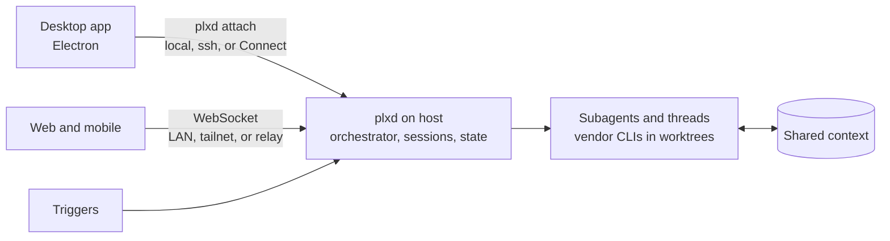

# Parallax: Project Plan

Updated Oct 9, 2026

Records in [decisions/](decisions/) supersede this plan where they differ. Work is tracked in the [Parallax project in Linear](https://linear.app/ryanstoffel/project/parallax-459c0ee45806) ([0021](decisions/0021-linear-work-record.md)).

## Overview

An open-source desktop app that reproduces the Cursor Projects workflow on machines you own. A project is one coordinator chat: it plans the work and delegates it to subagents that share project context.

The reference architecture is Cursor's [Introducing Projects](https://cursor.com/blog/projects) (Sep 10, 2026). The differences: the host is any machine you own, local or over SSH, and agents run through your own AI subscriptions, managed inside the app.

## Goals and non-goals

Goals:

* Run projects on this computer or any machine reachable over SSH
* Threads that work like T3 Code's: its orchestration, long-lived provider sessions, checkpoints and revert, delegation, schedules, PR watches, terminals, and agent tools ([0059](decisions/0059-orchestration-rewrite.md) to [0064](decisions/0064-agent-ui-tools-and-terminals.md))
* Reach every host from any device: Parallax Connect, LAN pairing, an SSH install, a web client plxd serves, a hosted relay, and a mobile app with push ([0056](decisions/0056-parallax-connect.md), [0065](decisions/0065-remote-reach.md))
* Run agents through your own subscriptions, using each vendor's official CLI, with API keys as a fallback ([0004](decisions/0004-subscription-providers.md))
* The app and `plxd` on macOS, Windows, and Linux ([0023](decisions/0023-cross-platform.md))
* Good performance

Non-goals:

* A hosted cloud service, except Parallax accounts ([0037](decisions/0037-accounts.md)) and Parallax Relay for remote access, webhooks, and push ([0065](decisions/0065-remote-reach.md))
* An editor. The Code - OSS fork was dropped ([0020](decisions/0020-drop-the-editor-fork.md)).
* Slack triggers

## Core concepts

| Concept | What it is | Cursor equivalent |
| --- | --- | --- |
| Project | A body of work that outlives one chat: a feature, a migration, or ongoing upkeep. It is one coordinator chat. | Project |
| Coordinator | The project's chat. It plans and delegates but never writes code, so it is never blocked. | Coordinator Agent |
| Subagent | A worker that runs one task in its own git worktree on the project's host | Subagent |
| Thread | A single agent chat in a repository, or in none, with no coordinator ([0017](decisions/0017-normal-threads.md)) | Agent chat |
| Shared context | A folder of Markdown files that `plxd` owns and mirrors to other machines. Agents add research, test instructions, and your preferences ([0005](decisions/0005-shared-context-folder.md)). | Shared context |
| Host | A machine running `plxd`: this computer, or one reached over SSH, Tailscale, the LAN, or the relay, such as a Mac mini | Cloud computer |
| Local agent | A subagent on your laptop, started by a coordinator on another host when something must run there | Local agent |
| Trigger | A schedule, a webhook, or a PR watch that wakes a thread or the coordinator ([0063](decisions/0063-schedules-pr-watches-and-delegation.md)) | Subscription |

Cursor calls triggers subscriptions. This plan says triggers to avoid confusion with AI subscriptions.

## Architecture

Two programs: the desktop app, and `plxd`, a Rust daemon that does everything else. With an external host, closing the laptop does not stop a project.

* Desktop app ([0022](decisions/0022-desktop-app.md)): Electron, React, and TypeScript in `apps/desktop/`, laid out like T3 Code. A sidebar of projects and threads, the chat, and a side panel for diffs and review. Its main process runs `plxd attach`, locally or over the user's `ssh`, and speaks JSON-RPC to it ([0007](decisions/0007-editor-plxd-protocol.md), [0010](decisions/0010-plxd-attach.md)).
* Host daemon (`plxd`): one per user per host. Its orchestrator records every change as a command with events, projections, and effects in one SQLite transaction ([0059](decisions/0059-orchestration-rewrite.md)), and keeps provider sessions alive between turns ([0060](decisions/0060-provider-sessions.md)). It runs the coordinator, whose tools are `plxd mcp` ([0019](decisions/0019-coordinator-mcp-tools.md)) on top of Claude Code's own configuration, in the permission mode you pick ([0027](decisions/0027-claude-permission-modes.md)), and threads, each a vendor CLI or SDK in its own worktree and sandbox ([0013](decisions/0013-worker-sandbox.md), [0014](decisions/0014-agent-runs.md), [0061](decisions/0061-claude-agent-sdk.md)). It owns shared context, terminals ([0064](decisions/0064-agent-ui-tools-and-terminals.md)), and triggers ([0063](decisions/0063-schedules-pr-watches-and-delegation.md)), and serves web and mobile clients when remote access is on ([0065](decisions/0065-remote-reach.md)).
* Subscriptions: `plxd` never handles consumer credentials. You sign in to each vendor's CLI on the host, and `plxd` routes each run to an account ([0004](decisions/0004-subscription-providers.md), [0012](decisions/0012-account-routing.md)).

## MVP and milestones

The MVP is one project on one host: a coordinator, two parallel subagents, shared context files, and diffs reviewable from the app.

| Milestone | Done when |
| --- | --- |
| [M0: Foundations](https://linear.app/ryanstoffel/issue/PLX-74) | The repo holds the desktop app and `plxd`, CI checks both on macOS, Windows, and Linux, and the decision records for Linear and cross-platform support are in |
| [M1: App shell](https://linear.app/ryanstoffel/issue/PLX-75) | The Electron app launches on all three OSes, talks to a local `plxd`, and runs threads |
| [M2: Hosts](https://linear.app/ryanstoffel/issue/PLX-76) | You add a local or SSH host from the app and connect to `plxd` on it. The daemon runs on macOS, Windows, and Linux. |
| [M3: Subscriptions](https://linear.app/ryanstoffel/issue/PLX-77) | You sign in with your own subscriptions, with API keys as a fallback. Runs route through them and usage shows per account. |
| [M4: Projects](https://linear.app/ryanstoffel/issue/PLX-78) | You describe a project once, and the coordinator plans it and runs parallel subagents in their own worktrees on a host. On an external host it keeps working with the laptop closed. |
| [M5: Review](https://linear.app/ryanstoffel/issue/PLX-79) | You review each task's diff in the app and turn accepted work into commits or PRs |
| [M6: Local agent + triggers](https://linear.app/ryanstoffel/issue/PLX-80) | With an external host, the coordinator starts a subagent on the laptop. Schedules and PR watches wake the coordinator without a prompt, with notifications. |
| [M7: Release](https://linear.app/ryanstoffel/issue/PLX-81) | Installable builds for macOS, Windows, and Linux, plus README, license, install steps, and a short demo |

Records dated before Sep 27, 2026 use the old numbering: M1 host daemon, M2 subscription manager, M3 single agent, M4 coordinator, M5 local agent, M6 triggers.

## Open questions and risks

Answered:

* The name is Parallax, and the daemon is `plxd`, not shared with Roster ([0003](decisions/0003-naming.md))
* Shared context is a folder `plxd` owns and copies, not git commits ([0005](decisions/0005-shared-context-folder.md))
* Providers: Claude Code first, then Codex, then Cursor once Cursor confirms in writing ([0004](decisions/0004-subscription-providers.md))
* The UI follows T3 Code's layout rather than Cursor's ([0022](decisions/0022-desktop-app.md))
* Triggers: schedules and PR watches first; Slack is out of scope ([PLX-59](https://linear.app/ryanstoffel/issue/PLX-59))
* How triggers wake the coordinator: as T3 Code's scheduled tasks and PR watches, which dispatch a message to the thread ([0063](decisions/0063-schedules-pr-watches-and-delegation.md))
* T3 Code parity: Ryan chose T3's orchestration, the Claude Agent SDK, and full remote reach on Oct 9, 2026 ([PLX-635](https://linear.app/ryanstoffel/issue/PLX-635))

Open:

* How a host's coordinator runs a local agent on the laptop ([PLX-55](https://linear.app/ryanstoffel/issue/PLX-55))
* Whether workers may reach the host's own interface addresses ([PLX-45](https://linear.app/ryanstoffel/issue/PLX-45))
* Versioning, packaging, and signing for three OSes ([PLX-64](https://linear.app/ryanstoffel/issue/PLX-64))
* Name conflict checks before release: GitHub, domains, trademarks, and package names ([PLX-71](https://linear.app/ryanstoffel/issue/PLX-71))

Risks:

* Subscription terms. Running consumer subscriptions from a third-party app may break vendor terms, and a public open-source app makes that more visible. Running only the vendors' own CLIs reduces this, and API keys stay as a fallback ([0004](decisions/0004-subscription-providers.md)).
* Coordinator quality. Weak task specs make workers fail. Start with the strongest model and grade plans by hand.
* Node.js. Claude, Cursor, and the browser tools need Node 22 or newer on the host ([0053](decisions/0053-cursor-sdk.md), [0061](decisions/0061-claude-agent-sdk.md), [0064](decisions/0064-agent-ui-tools-and-terminals.md)).
* The relay. Parallax Relay is a hosted service Ryan pays for and runs, and it needs his Cloudflare, Apple, and Google accounts ([0065](decisions/0065-remote-reach.md)).
* The rewrite. Replacing the run actor touches every thread path. Each phase is held to the load budgets and PLX-609's numbers ([0059](decisions/0059-orchestration-rewrite.md)).
* Three OSes. Each has its own transport, service, secret store, and sandbox, and native Windows can't sandbox Claude workers, which run in WSL2 instead ([0023](decisions/0023-cross-platform.md)).
