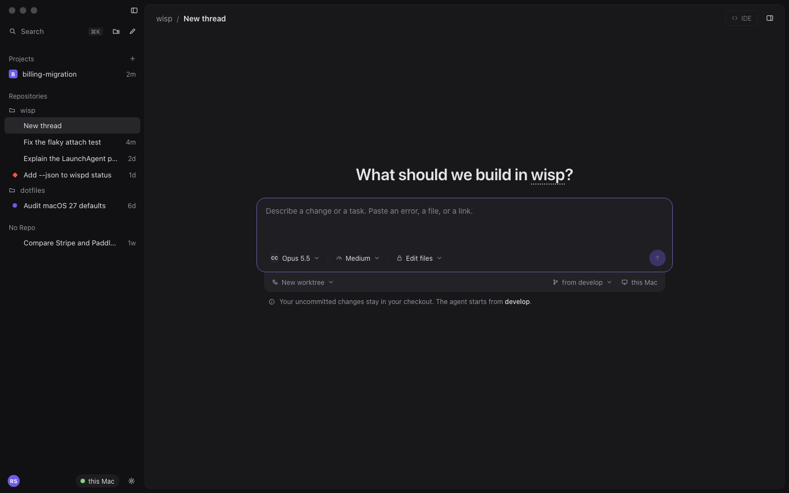
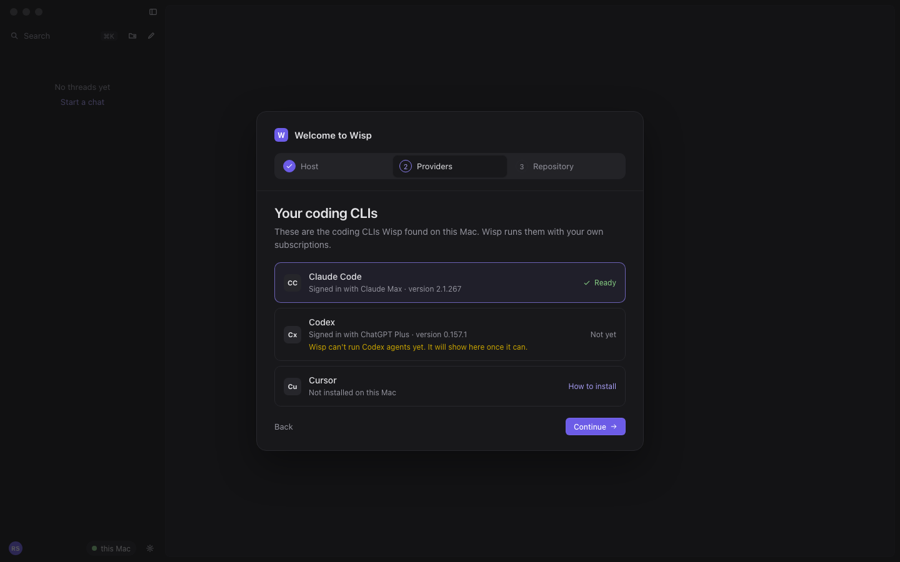
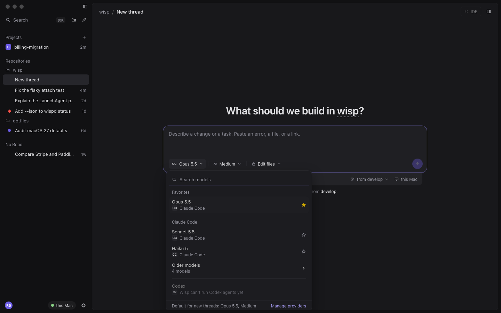
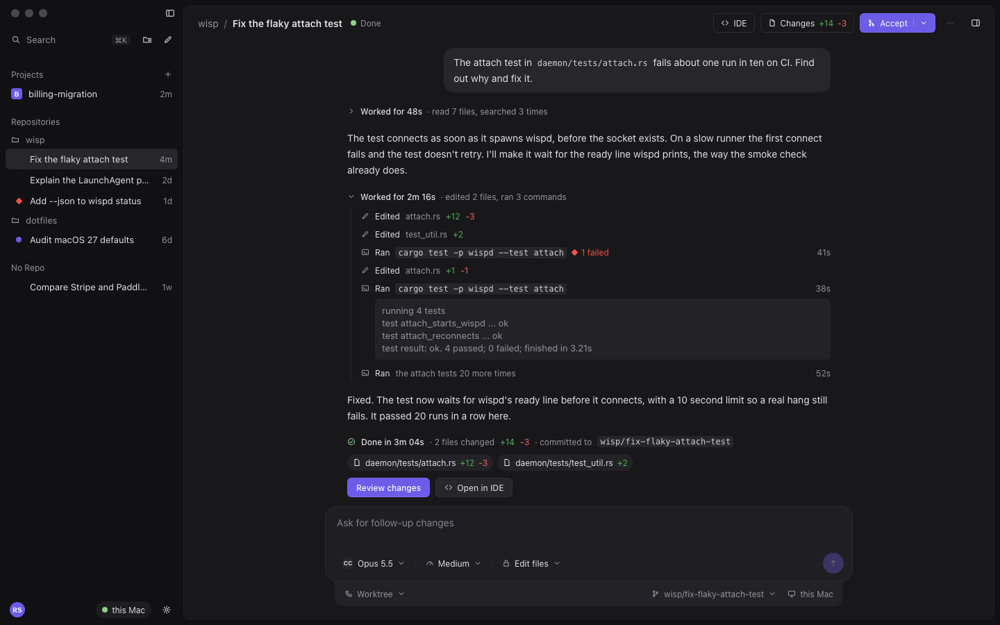
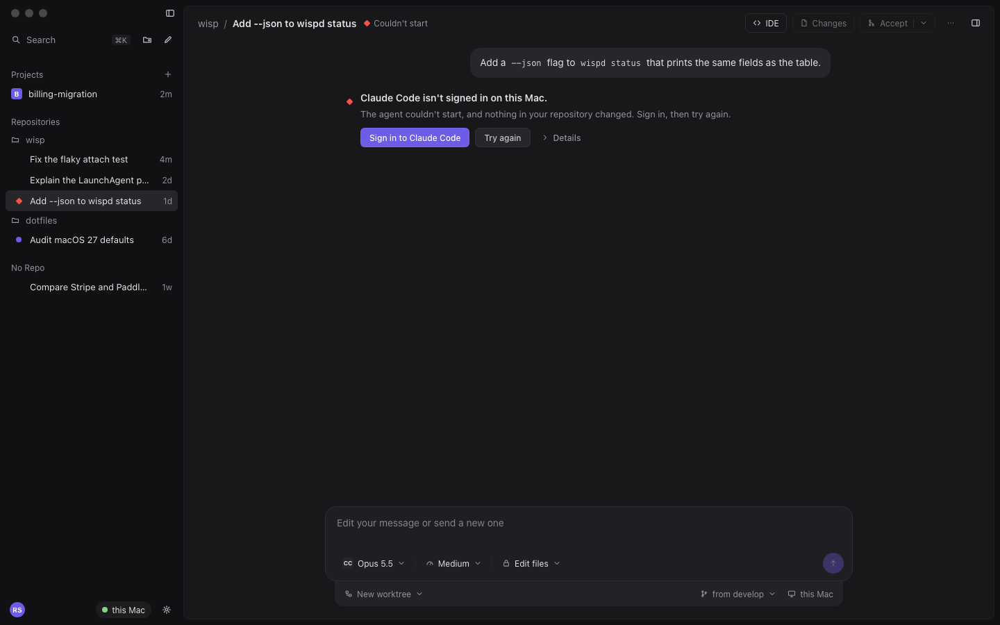
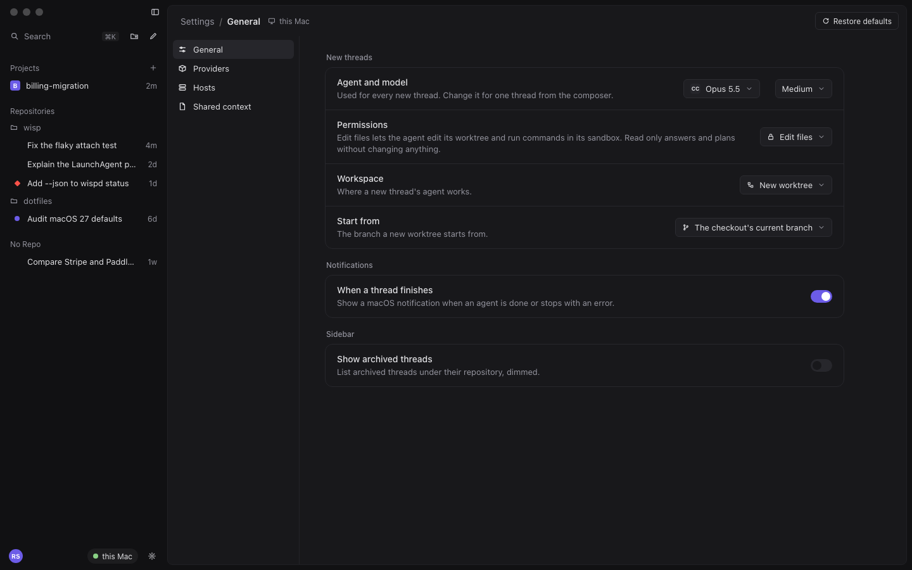
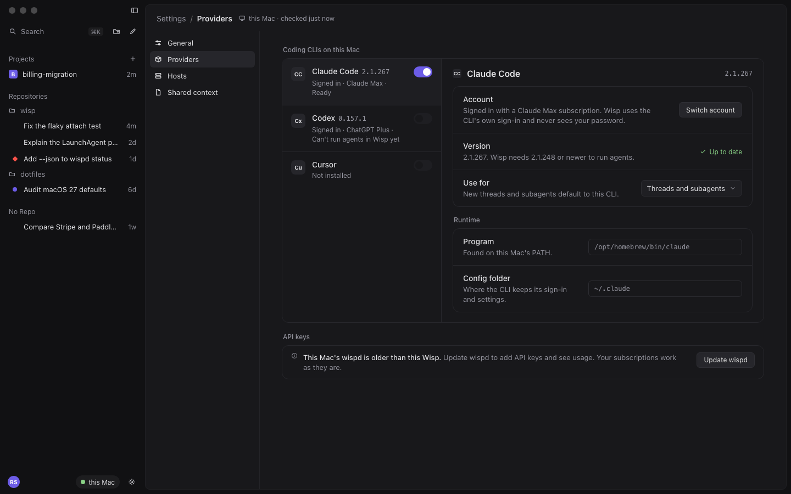

# Chat v2

- Status: design for M3, from #271, after Ryan tested 0.2.0 (#260) and called the chat UI "super super awful".
- Builds on [agents-window.md](agents-window.md) and decisions [0011](../decisions/0011-agents-window-baseline.md), [0013](../decisions/0013-worker-sandbox.md), [0015](../decisions/0015-subagent-chats.md), and [0017](../decisions/0017-normal-threads.md). The window layout from 0011 stays: wisp's sidebar, the session card, the right panel, and the Agents pill. This document replaces how the surfaces inside it look and read: setup, the empty thread, the composer, the transcript, the header, the sidebar, and Settings.
- Reference: Ryan shared screenshots of T3 Code, an open-source agent GUI. They are kept out of this public repository. Below, its design principles are restated in our own words, and the mockups use Wisp's own look: no T3 name, logos, provider marks, or copied assets. Agents appear as neutral monograms (CC, Cx, Cu).

## What is wrong today

From the 0.2.0 build and the CI screenshots on #264:

- **Notice cards everywhere.** Every CLI ending becomes a bordered info card ("Finished. 1 file changed, +1 -0.") with a separate button under it. Every stream event wisp doesn't know becomes a warning card (#258).
- **Protocol text shown to people.** Settings shows "Method not found: accounts/keys/list". Tool calls read as raw tool names ("Write FAKE_AGENT_NOTES.md"). The branch reads `wisp/ca6b79df`, a run id.
- **No focal point on a new thread.** A small composer floats mid-screen under two pills: a `workspace` pill, and a disabled `Wisp` pill that offers nothing. The placeholder says "Pitch your idea". A **Models** button opens nothing.
- **Questions asked every time.** New Chat asks for an account on every thread and lists backends that can't run agents (#259).
- **Dead ends.** A repository with local changes can't start a thread (#257). Errors say what broke but not what to do.
- **The header does nothing.** It is a bare title and `...`. The title bar adds a folder pill, back and forward buttons, and a Run button that mean nothing for a thread.

## Principles

These are what Ryan liked in the reference, restated as rules for Wisp.

1. **One thing to look at.** Each screen has one focal point. A new thread is a question and a composer. A running thread is the conversation. Setup is one card.
2. **Quiet by default, detail on request.** Tool calls, reasoning, and command output fold into one summary line per stretch of work. Expanding shows every step, and expanding a step shows its output.
3. **Say it like a person.** No method names, event kinds, run ids, stack traces, or raw vendor output in the default view. Errors name what happened and what to do next, with a button that does it. Raw detail sits behind **Details**.
4. **Controls live where you act.** Model, effort, and permissions sit inside the composer. Where the agent works (workspace, branch, host) sits right under it. Actions on the thread's result sit in the header and at the end of the turn.
5. **Remember, don't re-ask.** A choice made once, such as the default agent and model, sticks until you change it. A backend that can't do the job is not offered, or is shown disabled with the reason.
6. **Hierarchy from type and space, not boxes.** Large, high-contrast headings; generous spacing; borders only around things you act on (the composer, setup options, settings groups). No card around a message that needs no action.
7. **State is a shape and a word.** Status marks keep a distinct shape and a text label (agents-window.md, States). Color is never the only signal.

## Theme

Wisp ships two color themes of its own, **Wisp Dark** (the default) and **Wisp Light**, as a built-in theme. They start from Dark Modern and Light Modern and change about 40 tokens: a deeper shell and session background, higher-contrast body text, quieter borders, and a violet accent (`#6c5ce7` dark, `#5b4ad6` light) that meets 4.5:1 with white button text. The overrides are in [`chat-v2/src/wisp-theme.css`](chat-v2/src/wisp-theme.css), and every mockup here uses them. People can still pick any other theme.

- Type scale: the empty thread heading is 30 px semibold; the header crumb and transcript body are 14 px; secondary lines are the Agents window's 12 px label size.
- Transcript column: 760 px wide at most, centered, with 32 px gutters.
- Radius: 16 px on the composer and setup card, 12 px on groups and popovers, and the Agents window's own radii elsewhere.

## Mockups

All mockups are 1440x900, in Wisp Dark and Wisp Light.

| Screen | Dark | Light |
| --- | --- | --- |
| Setup, step 1: host | [setup-host-dark.png](chat-v2/setup-host-dark.png) | [setup-host-light.png](chat-v2/setup-host-light.png) |
| Setup, step 2: providers | [setup-agents-dark.png](chat-v2/setup-agents-dark.png) | [setup-agents-light.png](chat-v2/setup-agents-light.png) |
| Setup, step 3: repository | [setup-repo-dark.png](chat-v2/setup-repo-dark.png) | [setup-repo-light.png](chat-v2/setup-repo-light.png) |
| Empty thread and composer | [empty-dark.png](chat-v2/empty-dark.png) | [empty-light.png](chat-v2/empty-light.png) |
| Model picker | [model-picker-dark.png](chat-v2/model-picker-dark.png) | [model-picker-light.png](chat-v2/model-picker-light.png) |
| Transcript, running | [running-dark.png](chat-v2/running-dark.png) | [running-light.png](chat-v2/running-light.png) |
| Transcript, finished, one group expanded | [finished-dark.png](chat-v2/finished-dark.png) | [finished-light.png](chat-v2/finished-light.png) |
| Transcript, failed to start | [error-dark.png](chat-v2/error-dark.png) | [error-light.png](chat-v2/error-light.png) |
| Settings, General | [settings-general-dark.png](chat-v2/settings-general-dark.png) | [settings-general-light.png](chat-v2/settings-general-light.png) |
| Settings, Providers | [settings-providers-dark.png](chat-v2/settings-providers-dark.png) | [settings-providers-light.png](chat-v2/settings-providers-light.png) |



## 1. First-run setup



A single card over the dimmed, empty window, with three steps in a segmented header. It shows on first launch, and again when the connected host has no provider that can run agents. Once it is finished or skipped, it stays away.

**Step 1, Host: "Where should agents run?"**
- One row per choice, as a radio list: **This Mac** (wispd's state and version on the second line, **Connected** on the right) and **A host over SSH** (opens the host menu's add flow).
- States: Connected (check, green text), Starting (spinner, "Starting wispd"), Not reachable (hollow dot and "Can't reach wispd on this Mac", with **Try again**).
- **Continue** is enabled once the chosen host is connected.

**Step 2, Providers: "Your coding CLIs"**
- One row per CLI that wispd detects: monogram, name, then one plain line: "Signed in with Claude Max · version 2.1.267".
- The readiness column on the right:
  - **Ready**: check and green text.
  - **Sign in**: a button that runs the existing sign-in flow (`wispSignIn.ts`).
  - **Update needed**: the second line explains it in words: "Claude Code 2.1.240 is older than the 2.1.248 Wisp needs to run agents. Update Claude Code, then check again."
  - **Not yet**: "Wisp can't run Codex agents yet. It will show here once it can." (#122, #123).
  - **Not installed**, with **How to install**, which opens the vendor's install page.
- The first ready provider becomes the default for new threads. This is the worker role default, set through `accounts/defaults/set` (#259). **Continue** is enabled when at least one provider is ready.

**Step 3, Repository: "Pick a repository"**
- Recent repositories wispd already knows (`thread/list` repo entries), then **Choose another folder on this Mac**, which runs the existing browse flow.
- **Start** opens the empty thread in that repository. **Skip, start a quick chat** opens a thread with no repo.

**Keyboard and accessibility.** The card is a `dialog` labeled "Welcome to Wisp", and each step is announced as "Step 2 of 3, Providers". The option lists are radio groups, so the arrow keys move and Space picks. Enter presses **Continue**, and Escape does nothing, since there is no way back without a host.

**Feasibility: custom view.** A Custom View Grid view (`AbstractCustomView`, `ICustomViewService`), as the no-host view already is (#12). Upstream's welcome is Copilot sign-in, and its onboarding tours are spotlights; neither can host a card. No patch.

## 2. Empty thread and composer


**Layout.** The heading and the composer are centered as one block, a little above the middle of the card. There are no pills above the composer.

- **Heading:** "What should we build in **wisp**?", with the repository name underlined with dots. Clicking the name opens the repository picker. With no repo, the heading is "What do you want to work on?". For a project's coordinator (M4), it is "What's the goal for **billing-migration**?".
- **Composer**: 760 px wide and at least three lines tall. The placeholder is "Describe a change or a task. Paste an error, a file, or a link." In a running thread it becomes "Send a message to the agent. It reads it after its current step." and after a turn, "Ask for follow-up changes".
- **Controls inside the composer**, on one row under the text, separated by thin rules:
  1. **Agent and model**: the provider's monogram and the model name ("Opus 5.5"), which opens the model picker.
  2. **Effort**: a gauge and "Medium". The choices are the model's own levels, such as Low, Medium, High, and Max. The control hides when the model has none.
  3. **Permissions**: a lock and "Edit files". The choices are **Edit files**, where the agent edits its worktree and runs commands in its sandbox (0013), and **Read only**, where it answers and plans without changing files. Full access with no sandbox is not offered; see the open questions.
  4. **Send** on the right: filled accent when there is text, dimmed when empty. While the agent works it becomes **Stop**, a square in a filled circle.
- **The workspace bar** is a slim, tinted strip tucked under the composer:
  - Left: **New worktree**, with a menu. Once a thread has started, it reads **Worktree** and can't change.
  - Right: the base branch ("from develop"), with a menu of local branches and the checkout's current branch first. Once started, it shows the thread's own branch (`wisp/fix-flaky-attach-test`). Then the host ("this Mac" with a monitor, or a server glyph and the host name), which opens the host menu.
- **Local changes note.** When the repository has uncommitted changes, a quiet line goes under the bar: "Your uncommitted changes stay in your checkout. The agent starts from develop." This replaces #257's failure.

**Model picker**



- A popover anchored under the model control, with a search field first and focus in it.
- **Favorites** comes first. The star on any row pins or unpins that model.
- One section per provider that can run agents, each with its models. Older model versions fold into **Older models (4)**, which expands in place.
- Providers that can't run agents yet show one disabled row with the reason ("Wisp can't run Codex agents yet"). They list no models.
- The footer shows "Default for new threads: Opus 5.5, Medium" and a **Manage providers** link to Settings.
- Picking a model sets it for this thread. Settings > General sets the default. **This removes the account prompt on New Chat (#259).** The provider comes from the model you pick. When only one provider can run agents, it is used without asking.

**Keyboard and accessibility.** ⌘N focuses a new thread's composer. Enter sends, and Shift+Enter adds a new line. ⌥⌘. opens the model picker (upstream's binding). In the picker, typing filters the list, ↑ and ↓ move, Enter picks, and Escape closes the picker and returns focus to the model control. Each control is a button labeled with its name and value, such as "Model: Opus 5.5, Claude Code". The heading is the page's `h1`.

**Feasibility**

| Piece | How | Cost |
| --- | --- | --- |
| Heading and placeholder | Not in upstream. The placeholder is hard-coded in `newChatWidget.ts` (line 260), and nothing renders above the composer except the pickers (around lines 476 to 492). | **Patch** `newChatWidget.ts`: read an optional heading and placeholder from the session provider. About 25 lines. |
| Hide the workspace and session-type pills | They always render. The type pill only dims when there's one type (`sessionTypePicker.ts`, lines 706 to 724). | **Patch**, in the same patch as the heading: hide that row when the provider asks. About 5 lines. |
| Model picker grouping, favorites, older models | `ISessionModelPickerOptions.useGroupedModelPicker` builds Pinned, then provider groups, then a collapsible "Other Models" section. Icons come from `getModelProviderIcon`, and wisp registers neutral monograms. | **Configure**: the provider returns models from `getModelsSnapshot` and sets `useGroupedModelPicker: true`. |
| Per-model ⌘1 to ⌘9 | Not upstream | Left out. It would need a custom picker. |
| Effort | A model's `configurationSchema` property with `group: 'navigation'` renders as upstream's effort control (`modelPickerModelConfig.ts`). | **Configure**, plus wispd reporting each model's levels |
| Model picker in a running thread | Upstream's in-chat picker hides for a contributed session type unless `chatSessionHasTargetedModels` is set. | **Configure**: set it for `wisp.agent` chats. |
| Permissions | Upstream's permission picker offers fixed Copilot levels and hides for contributed sessions. Providers register their own picker through `actionViewItemService`. | **Custom action view item** on `Menus.NewSessionControl` and `MenuId.ChatInputSecondary`, as `wispComposerAccount.ts` does today. No patch. |
| Workspace bar | `Menus.NewSessionRepositoryConfig`, the row under the new-session composer (`newChatInput.ts`, line 818). It is where upstream's branch picker lives. | **Configure**: action view items there. In a running thread, the existing footer (`MenuId.ChatInputSecondary`, `wispComposerFooter.ts`). |
| Model, effort, permission, and base branch reach the run | `thread/start` takes only `account` (0017). `AgentPolicy` has only `workspaceWrite`. | **wispd**: new optional params, and a read-only policy mapped to the existing `ToolPolicy::NoWrite` |

## 3. Transcript



**Messages**
- **Your message**: a right-aligned bubble, 14 px, with inline code in monospace chips.
- **The agent's reply**: full-width text, 14 px with a 23 px line height, and no bubble. Markdown, code blocks, and file links render as upstream's chat does.

**Work, collapsed by default**
- Each stretch of tool calls and reasoning between two replies is one line: a chevron, "**Worked for 48s** · read 7 files, searched 3 times". The summary counts steps by kind.
- Expanded, each step is one row: an icon, a verb, and a subject, with a duration on the right for commands.
  - The verbs are plain: **Read** `attach.rs`, **Edited** `attach.rs` +12 −3, **Created** `notes.md`, **Ran** `cargo test -p wispd`, **Searched** for "ready" in `daemon/`, **Fetched** `docs.rs`, **Searched the web** for "…", and **Updated the checklist**.
  - Tool names such as `Write`, `Bash`, and `Grep` never appear.
  - The subject is the file's base name, the command's first line, or the pattern, cut at 60 characters (`toolSubject` already does this).
- Expanding a row shows its input and output in a tinted monospace block, capped at about 12 lines with **Show all**.
- **A failed step** keeps its row. It gets a diamond and "1 failed" in the error color, and the group's summary says "1 failed". The group stays collapsed: a failed test the agent went on to fix is not an alarm.
- **A denied step**: "The sandbox blocked `curl localhost:3000`", with the diamond.
- **While running**, the current group shows a spinner and the live step: "**Working for 1m 06s** · edited 2 files · running `cargo test -p wispd --test attach`".
- **Reasoning** folds into the same group, and it is visible when expanded.

**Notices and noise**
- A vendor `notice`, such as "Compacting the conversation", is a transient progress line. It goes away when the next step arrives.
- A wispd `warning` (output wispd skipped) and unknown event kinds are never shown. They go to the log (#258).
- A message that never reached the agent is a quiet line, "Your message didn't reach the agent before it stopped", with **Send again**.

**Finished**

- A turn that ends well closes with a small status line, then the files, then the actions:
  - "✓ **Done in 3m 04s** · 2 files changed +14 −3 · committed to `wisp/fix-flaky-attach-test`". The check is drawn as an icon, not a character.
  - One chip per changed file, with its +/− counts. Clicking a chip opens that file's diff.
  - **Review changes** (primary) opens the diff review (#157). **Open in IDE** opens the worktree in the editor window.
- With no changes, only the line shows: "Done in 40s. No files changed."
- **Stopped** by you: a square mark, then "Stopped · 1 file changed +3 −0", **Review changes**, and **Retry**.
- **Interrupted**, when wispd restarted: "wispd restarted before the agent finished. Send a message to pick up where it left off." There is no button, because the composer is the action.
- There are no bordered cards. The only buttons in the transcript are the ones that do something.

**Errors, stated plainly**



A failed run ends with a diamond, a one-sentence headline, one line on what it means for your work, and buttons. The vendor's own message sits behind **Details**, collapsed. Copy for each `AgentFailureKind`:

| Kind | Headline | Second line | Actions |
| --- | --- | --- | --- |
| `notSignedIn` | {CLI} isn't signed in on {host}. | The agent couldn't start, and nothing in your repository changed. Sign in, then try again. | **Sign in to {CLI}**, Try again |
| `rateLimited` | You've reached your {subscription} usage limit. | {CLI} says it resets at {time}. Your work so far is saved on the thread's branch. | Try again, Switch model |
| `policyViolation` | The agent tried something its sandbox doesn't allow, so Wisp stopped it. | Changes made before that are committed on its branch. | **Review changes**, Try again |
| `unexpectedApiKey` | {CLI} tried to use a different account than the one you picked. | Wisp stopped it so nothing is billed to that account. Check {CLI}'s own settings. | **Open Providers** |
| `vendorError` | {CLI} reported an error. | The first line of the vendor's message, in plain text | Try again |
| `crashed` | {CLI} stopped unexpectedly. | Changes made before that are committed on its branch. | Try again |
| `spawnFailed` | Wisp couldn't start {CLI} on {host}. | Check that it's installed and up to date. | **Open Providers**, Try again |
| `commitFailed` | The agent finished, but Wisp couldn't save its work to a branch. | The changes are still in its worktree. Set a git name and email for this repository, then try again. | Try again |
| `internal`, or unknown | Something went wrong in wispd. | Details has what wispd reported. | Try again |

Errors from starting the thread use the same shape:

- An older wispd: "This Mac's wispd is older than this Wisp." with **Update wispd**.
- A folder that isn't a repository: "That folder isn't a git repository." with **Choose another folder**.
- An unknown method never shows its name.

**Keyboard and accessibility.** Each work group is a button with `aria-expanded`, labeled with its summary. Upstream's Accessible View reads the whole transcript, including collapsed steps. The finished line and error headlines are announced politely once, when they arrive.

**Feasibility**

| Piece | How | Cost |
| --- | --- | --- |
| Collapsed tool groups | `chat.agent.thinking.collapsedTools` defaults to `always` and folds tool calls into a thinking group. `chat.agent.thinkingStyle: collapsedPreview` shows the live step. `ChatSimpleToolProgressPart` rows are collapsed by default. | **Configure**: set `chat.agent.thinkingStyle` and turn `chat.agent.thinking.generateTitles` off, since it needs a language model wisp doesn't have. Check that neither setting has its own `agentsWindow.default` (see `wisp.sessions.contribution.ts`). |
| Plain verbs and subjects | `invocationMessage` and `pastTenseMessage` of each `toolInvocationSerialized` part, built in `wispAgentTranscript.ts` | **Configure**: overlay code only |
| "Worked for 48s · read 7 files" | Upstream titles the group "Finished with N steps" or "Finished Working" (`chatThinkingContentPart.ts`). | Try to supply the title from the content provider. Otherwise v1 keeps upstream's label, and a count summary is a follow-up patch, about 15 lines. |
| No notice cards | `info` and `warning` parts render as notification cards (`ChatErrorContentPart`). `progressMessage` is quiet and transient. Markdown with a `$(codicon)` is quiet and stays. | **Configure**: use `progressMessage` and `markdownContent`, and drop `info` and `warning` parts from wisp's transcript. |
| Finished summary and file chips | The `multiDiffData` part renders "Changed N files", a collapsible file list with +/−, and **Open Changes**. More buttons come from `MenuId.ChatMultiDiffContext`. | **Configure**: emit `multiDiffData` from `agent/diff`, and contribute **Review changes** and **Open in IDE** to that menu. |
| Error actions | A `command` part renders a primary button, and `additionalCommands` render as secondary ones (`chatCommandContentPart.ts`). | **Configure** |
| Details disclosure | A collapsed `toolInvocationSerialized` part titled "Details", with the raw message as its output | **Configure** |

## 4. Header

The session header becomes a breadcrumb and a few clear actions.

- **Left:** "wisp / Fix the flaky attach test". The repository is muted, and clicking it filters the sidebar to that repository. The title is semibold and click-to-rename, as upstream's is. Then the thread's state: a mark and a word (Working, Done, Stopped, Couldn't start).
  - For a thread with no repo, the crumb is "No repo / {title}". For a project, it is the project's name alone, since its coordinator is the project.
- **Right**, in this order:
  - **IDE**, today's button, which opens the worktree in the editor window.
  - **Changes +14 −3**, which opens the right panel's Changes tab.
  - **Accept**, a split button that merges the thread's branch into the checkout's current branch (#68, `wisp.acceptAgentChanges`). Its menu has **Request changes** and **Copy branch name**. Accept is primary only when the thread is done with changes; otherwise it is dimmed.
  - `...`: Rename, Archive, and Delete.
  - The right-panel toggle.
- **The title bar** loses the folder pill, back and forward, and the Run button. They do nothing for a wisp thread, and the breadcrumb says where you are.

**Keyboard and accessibility.** The crumb is a `nav` labeled "Thread", and its state is part of the title's accessible name: "Fix the flaky attach test, Done". ⌘⇧A runs Accept, with a confirmation that names the target branch.

**Feasibility.** Actions: **configure**, through `Menus.SessionBarToolbar` in `SessionHeader` (`sessions/browser/parts/sessionHeader.ts`). Breadcrumb: **patch** `sessionHeader.ts` to render the session's workspace label before the title, about 10 lines. Title bar pieces: **configure**, by adding their action ids to the existing exclusion list (patch 0015's list) or hiding them with `when` clauses in the overlay. No new patch file.

## 5. Sidebar

wisp's own `wisp.threads` view, so every change here is overlay code.

- **Top:** a search field ("Search", ⌘K) that fills the row, then two icon buttons: **Add repository** and **New chat** (⌘N). Customize moves to the gear in the footer. This replaces today's three-row action list.
- **Sections:** Projects (with `+`), Repositories (a quiet folder row per repository, with its threads under it), and No Repo, as 0011 has them. Section titles are plain, muted, and in sentence case.
- **Rows:** a status mark on the left only when the thread needs attention (running, needs review, failed), then the title and a relative age. An idle or done thread shows no mark.
- **Empty state:** centered, muted "No threads yet", with a **Start a chat** link.
- **Footer:** your avatar, the host chip, and the gear, with no border above it.

**Feasibility: custom view (existing).** `wispThreadsView.ts` and `wispThreadSections.ts`. No patch.

## 6. Settings

A **Settings** editor in the Agents window, opened from the footer gear. It has its own left navigation: **General**, **Providers**, **Hosts**, and **Shared context**. The header uses the same breadcrumb ("Settings / General") and names the host the page applies to. Rows are grouped in rounded groups with a title and one line of help each.

**General**



| Group | Setting | Control | Stored |
| --- | --- | --- | --- |
| New threads | Agent and model | Model picker and effort menu | On the host, with the worker role default (`accounts/defaults/*`) |
| New threads | Permissions: Edit files or Read only | Menu | On the host, with the role default |
| New threads | Workspace: New worktree, or Current checkout if allowed | Menu | Editor setting `wisp.threads.workspace` |
| New threads | Start from: the checkout's current branch, or a named branch | Menu | Editor setting `wisp.threads.baseBranch` |
| Notifications | When a thread finishes or fails | Toggle, on | Editor setting `wisp.notifications.threadFinished` |
| Sidebar | Show archived threads | Toggle, off | Editor setting `wisp.threads.showArchived` (#223) |

**Restore defaults** in the header resets this page only.

**Providers**



- **Left:** one row per CLI wispd detects: monogram, name, version in monospace, and one status line ("Signed in · Claude Max · Ready"). A toggle turns the provider off for Wisp, which hides it from pickers and setup. Providers that can't run agents yet have their toggle disabled, and the status line says why.
- **Right:** the selected provider.
  - **Account**: "Signed in with a Claude Max subscription. Wisp uses the CLI's own sign-in and never sees your password." with **Switch account**, the existing sign-in flow.
  - **Version**: "Wisp needs 2.1.248 or newer to run agents", then **Up to date**, or an update warning in words.
  - **Use for**: threads and subagents, which sets the role defaults.
  - **Runtime**: the program path and config folder wispd found. They are read-only until someone needs to override them.
- **API keys** and **Usage** move under the list. When wispd lacks a method, one plain line replaces the section: "This Mac's wispd is older than this Wisp. Update wispd to add API keys and see usage. Your subscriptions work as they are." with **Update wispd**. It never says "Method not found".
- Header: "Checked just now", with a refresh.

**Keyboard and accessibility.** The navigation is a list, and ↑ and ↓ move through it. Each row's control is labeled with the row title. Toggles are switches with `aria-checked`.

**Feasibility: custom view.** An `EditorPane` registered as the Accounts editor is today (`wispAccountsEditor.ts`), renamed and extended. Upstream's Agents window has no settings UI of its own; it opens the normal settings editor. Editors open in the single-pane editor part. No patch.

## Feasibility summary

| Screen | Configure upstream | Patch | Custom view | wispd |
| --- | --- | --- | --- | --- |
| First-run setup | | | Custom View Grid view | Provider readiness |
| Empty thread | Grouped model picker, effort via model metadata, workspace bar menu | `newChatWidget.ts`: heading, placeholder, hide pills (about 30 lines) | Permissions picker (an action view item) | Models, effort levels, `thread/start` params |
| Transcript | Thinking and tool collapse settings, `multiDiffData`, `command`, `progressMessage` parts | Only if the group title can't come from the provider (about 15 lines, follow-up) | | Branch names from the task |
| Header | `Menus.SessionBarToolbar`, exclusions for title bar items | `sessionHeader.ts`: breadcrumb (about 10 lines) | | |
| Sidebar | | | wisp's own view (exists) | |
| Settings | | | `EditorPane` (exists as Accounts) | Role defaults with model, effort, permission |
| Theme | Built-in color theme | | | |

**Patch budget.** Two new patches, about 40 changed lines, both in the `sessions/` layer. That goes beyond 0011's list (imports, exclusions, strings, the pill), so each implementing PR adds its patch to 0011's patch table and notes the file's upstream churn. `newChatWidget.ts` is next to `newChatInput.ts`, which agents-window.md warned churns heavily. The heading patch touches one render method and one option, and if an upgrade conflicts, dropping it loses the heading and placeholder but nothing functional.

## Open questions for Ryan

Posted on #271. Where the design had to choose, the safer default is what the mockups show.

1. **Current checkout as well as a worktree?** In the reference, threads run in the current checkout by default. 0013 lets agents write only their own worktree, and 0017 rejected running in the checkout because your edits and the agent's would mix and wispd couldn't commit the agent's work on its own branch.
   - Proposal: allow **Current checkout** as an opt-in, per thread, from the workspace menu. The default stays **New worktree**. In the checkout, the sandbox's write root is the checkout, wispd doesn't commit, one thread at a time may run there, and Review shows the working tree diff instead of Accept.
   - **Default until you answer:** worktree only. The option isn't shown. This needs a decision record that amends 0013 and 0017 if you say yes.
2. **Full access?** The reference offers a no-sandbox level. Proposal: no. v1 offers **Edit files** (the 0013 sandbox) and **Read only**. **Default:** those two.
3. **Push and pull requests from the header?** Proposal: **Accept** (merge locally) only in M3, with Push and Create PR later. **Default:** Accept only.
4. **A Wisp theme as the default?** Proposal: ship Wisp Dark and Wisp Light and make Wisp Dark the default for new installs. Other themes stay selectable. **Default:** yes, since it is a setting and easy to undo.
5. **A compact sidebar top row?** Search plus two icon buttons replaces the vertical action list from your Cursor reference (0011, decision 2). **Default:** yes. It's wisp's own view and easy to revert.
6. **Setup on every new host?** Proposal: first launch, and any time the connected host has no ready provider. **Default:** that.

## Implementation tasks

All in M3 (#23). Each is one PR.

| Issue | Task | Role | Depends on |
| --- | --- | --- | --- |
| #291 | wispd reports each CLI's models, effort levels, and readiness | Software engineer | None |
| #292 | wispd takes model, effort, permission, and base branch on `thread/start` | Software engineer | #291, #257 |
| #293 | wispd names worktree branches after the task | Software engineer | None |
| #294 | Wisp Dark and Wisp Light themes | Design engineer | None |
| #295 | Tool calls collapse into plain-language steps | Design engineer | #258 |
| #296 | Each turn ends with a changes summary and Review changes | Design engineer | None |
| #297 | Agent failures in plain language with an action | Design engineer | #296 |
| #298 | Empty thread heading and roomy composer (patch) | Design engineer | #294 |
| #299 | Agent and model picker in the composer; folds in #259 | Design engineer | #291, #292, #259 |
| #300 | Effort and permission controls | Design engineer | #299 |
| #301 | Workspace and branch bar under the composer | Design engineer | #292, #257 |
| #302 | Header breadcrumb and actions (patch) | Design engineer | None |
| #303 | Sidebar search row, status marks, empty state | Design engineer | #294 |
| #304 | First-run setup | Design engineer | #291, #294 |
| #305 | Settings: General | Design engineer | #292 |
| #306 | Settings: Providers | Design engineer | #291, #305 |

The ones with no dependencies (#291, #293, #294, #296, #302) can start in parallel. Every editor task updates its screenshot scenario, so a PR shows its own screen. Current checkout mode has no task until Ryan answers the first open question.

## Revising the mockups

The sources are in [`chat-v2/src/`](chat-v2/src/):

- `index.html` loads the Agents window's captured tokens (`../../agents-window/src/tokens.css`), `wisp-theme.css`, and `chat.css`.
- `mock.js` builds each scene from URL parameters (`?scene=finished&theme=wisp-dark`).

Playwright is not a repo dependency, so render from a temp directory that has it:

```sh
cd "$(mktemp -d)" && npm install playwright-core@1.63.0 && npx playwright-core install chromium
node <repo>/docs/design/chat-v2/src/render.mjs                 # all scenes, both themes
node <repo>/docs/design/chat-v2/src/render.mjs finished-dark   # one image
```
